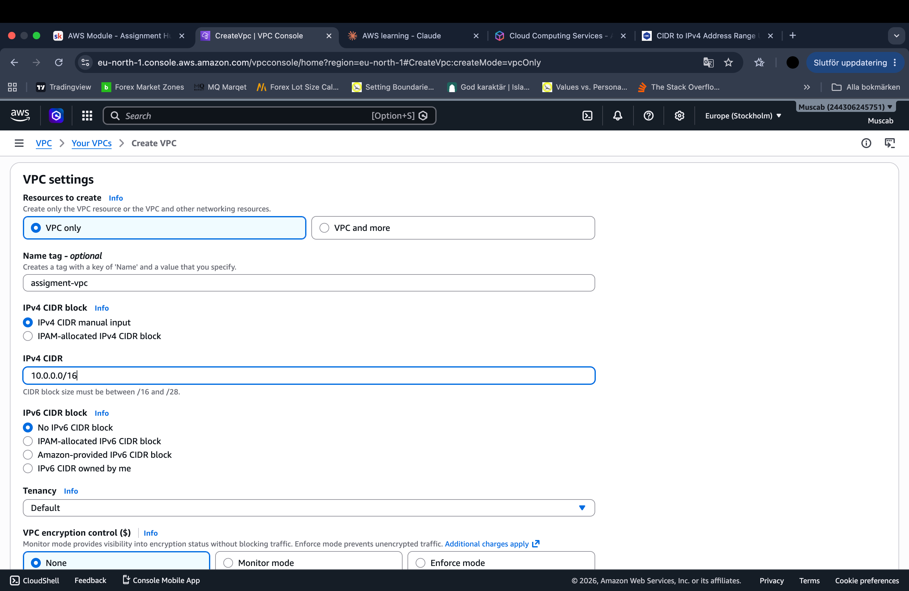

**AWS VPC NETWROKING PROJECT** 

This project walks through creating a custom AWS VPC with public subnets across multiple Availability Zones, an Internet Gateway, routing tables, EC2 instances, and security controls. The focus is on understanding traffic flow in AWS networking, not just resource deployment. All components were validated via the AWS Console and from within the instances using SSH and networking commands.

**Step 1: Create a VPC**

