# **AWS VPC NETWROKING PROJECT** 

This project walks through creating a custom AWS VPC with public subnets across multiple Availability Zones, an Internet Gateway, routing tables, EC2 instances, and security controls. The focus is on understanding traffic flow in AWS networking, not just resource deployment. All components were validated via the AWS Console and from within the instances using SSH and networking commands.
 
**Infrastructure**

A custom VPC (10.0.0.0/16)
A Public Subnet (10.0.1.0/24)
A Private Subnet (10.0.2.0/24)
Internet Gateway (IGW) for public internet access
NAT Gateway for private outbound internet access
Public EC2 instance acting as a bastion host
Private EC2 instance
Security Groups controlling access between resources

 **Architecture Diagram**
 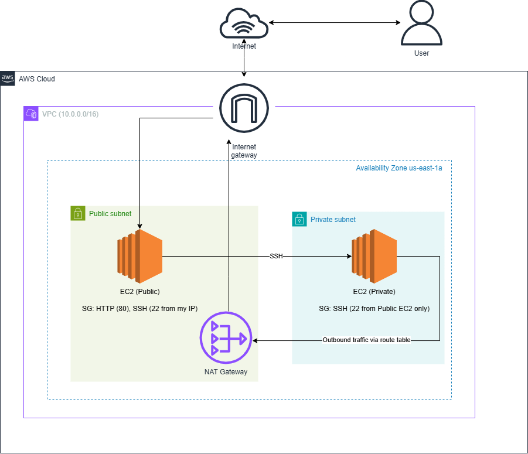

**Step 1: Create a VPC**

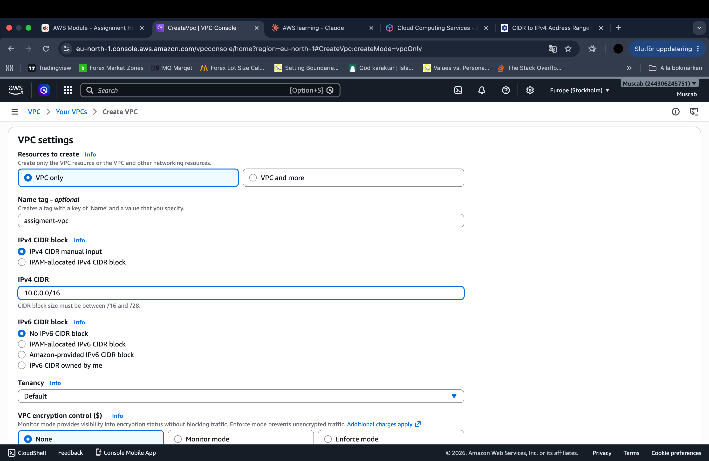

**Why this step exists**
A VPC provides an isolated networking boundary in AWS. All subnets, route tables, and instances must reside inside a VPC.

**What was done**

A custom VPC was created using the CIDR block 10.0.0.0/16 to allow sufficient IP space for multiple subnets.

**Step 2: Public Subnet And Private Subnet**
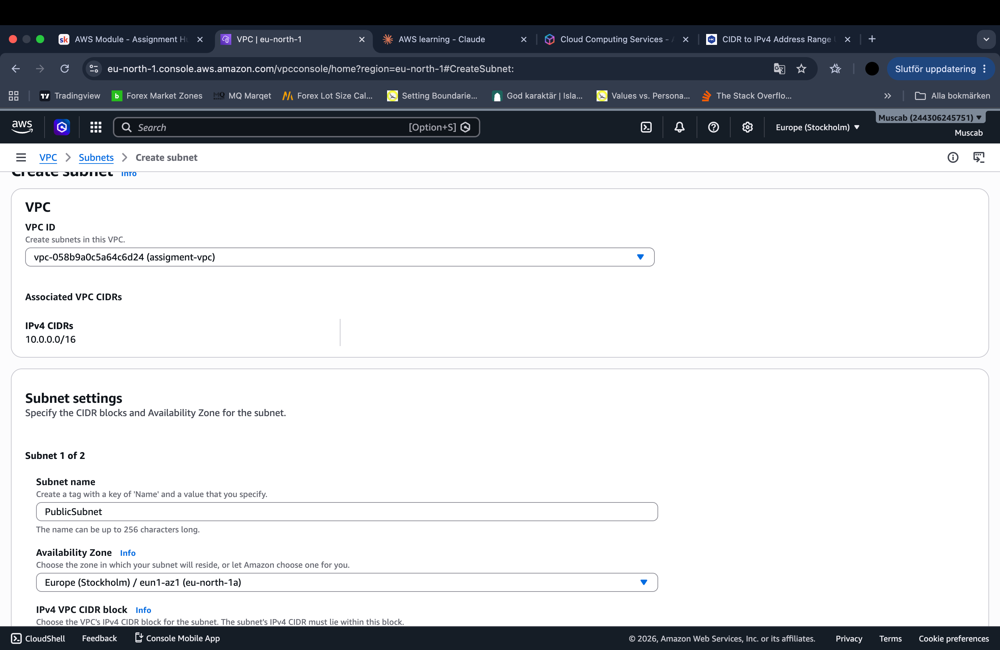
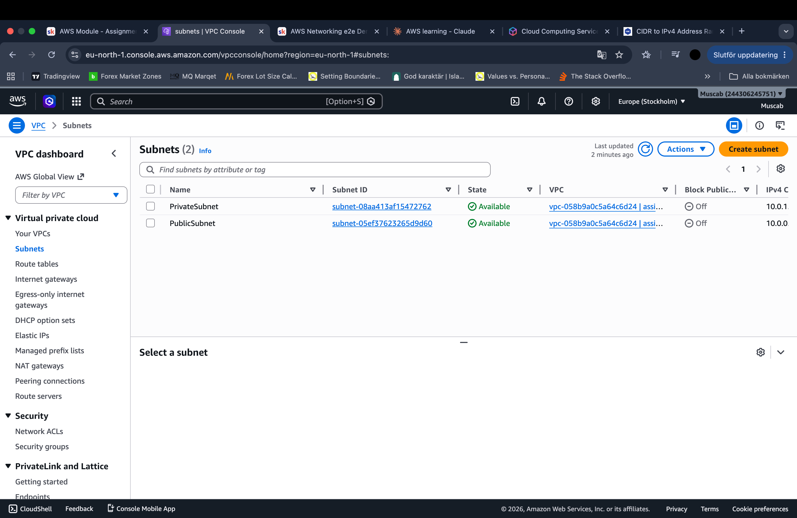

**Subnet Division – Public vs Private**
To simulate a secure, production-like environment, the VPC was divided into two separate subnets:

**Public Subnet**
- Hosts resources that need to be accessible directly from the internet

- Has a route to the Internet Gateway (IGW) for inbound/outbound traffic

**Private Subnet**
- Hosts resources that must remain isolated and protected from the internet

- Examples: databases, application servers, internal services

- Has no direct internet access (only outbound via NAT Gateway if needed)

**Why This Matters**
- This separation is a fundamental principle in real-world cloud architecture

- It follows the principle of least privilege. Only expose what is necessary

**# Step 3: Internet Gateway Creation**
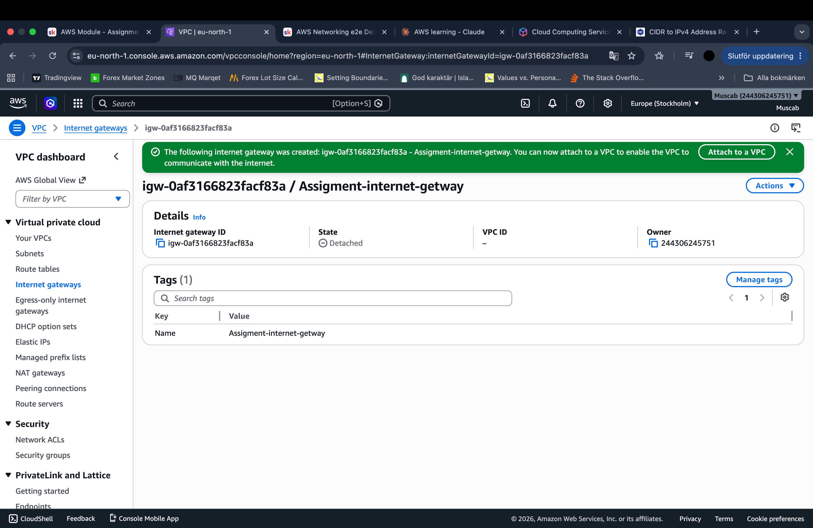
**- Internet Gateway Attached to VPC**
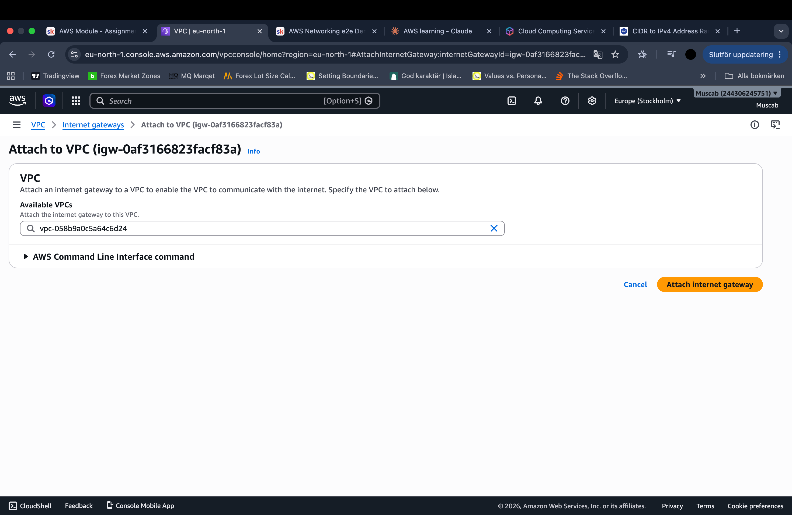

An Internet Gateway was attached to the VPC to allow resources in the public subnet to communicate with the internet.

A route was configured:

0.0.0.0/0 → Internet Gateway
This allows inbound and outbound internet traffic for the public subnet.

**Step 4: NAT Gateway**

**Its role is to enable:**
- Outbound internet access from instances in the private subnet

- Inbound connections from the internet are blocked

**Why this is important:**
Private resources remain secure and isolated from incoming traffic

**They can still perform necessary tasks such as:**

- Installing software packages

- Downloading security updates

- Accessing external APIs or services

**Step 5: Route Tables** 

Two route tables were configured:
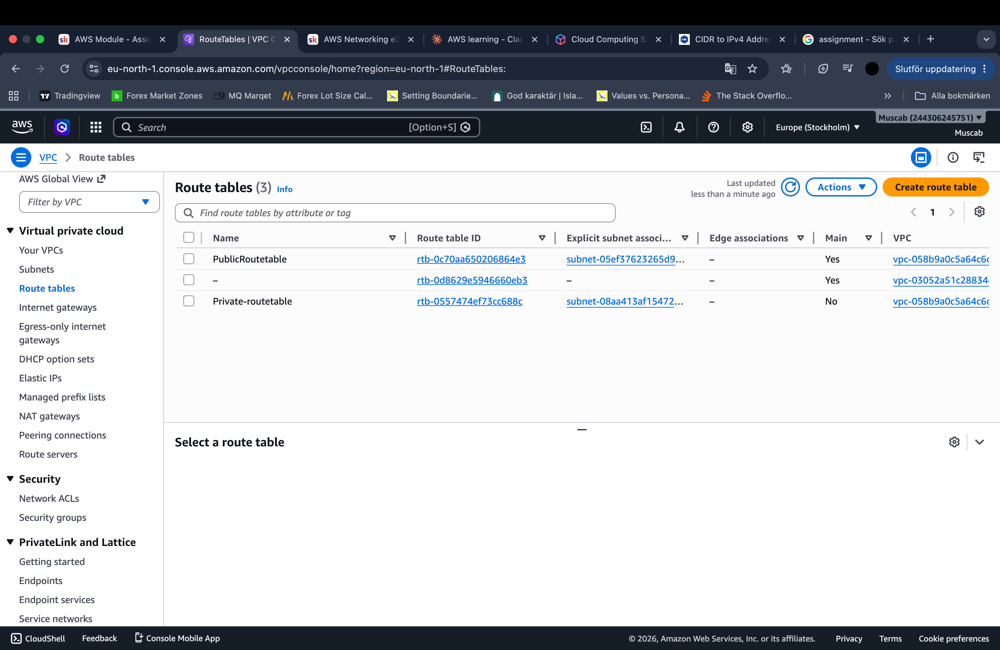

**Public Route Table**
- Route: 0.0.0.0/0 → Internet Gateway
- Associated with the public subnet

**Private Route Table**
- Route: 0.0.0.0/0 → NAT Gateway
- Associated with the private subnet

**Step 6: Security Groups**
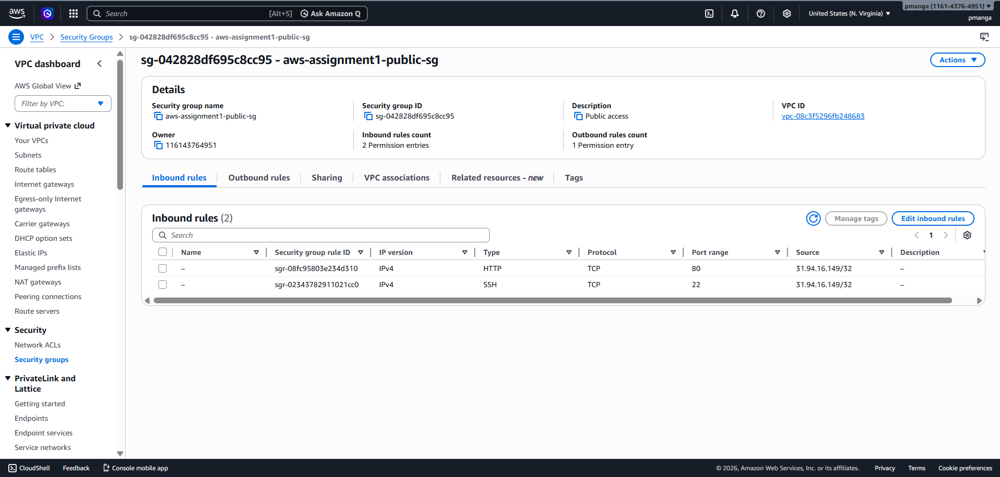

**Public EC2 Security Group**
This Security Group controls traffic to the internet-facing instance.

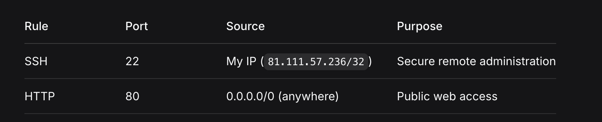

✅ SSH (port 22) – from my IP only
Why? Only the administrator should have remote access.

✅ HTTP (port 80) – from anywhere (0.0.0.0/0)
Why? The web server must be accessible to all visitors.

Outbound rules:

✅ All traffic – to anywhere
Why? The instance needs to download updates and respond to requests.

**Private EC2 Security Group**
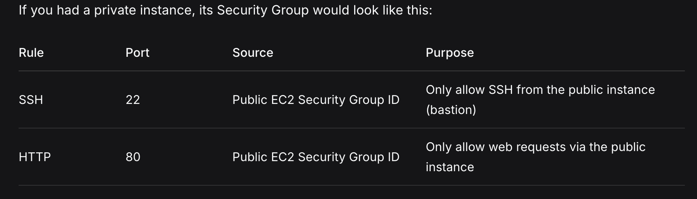
**Key principle:**
- The private instance only accepts traffic from the public instance – never directly from the internet.

**Step 7:Testing and Confirming ✅**
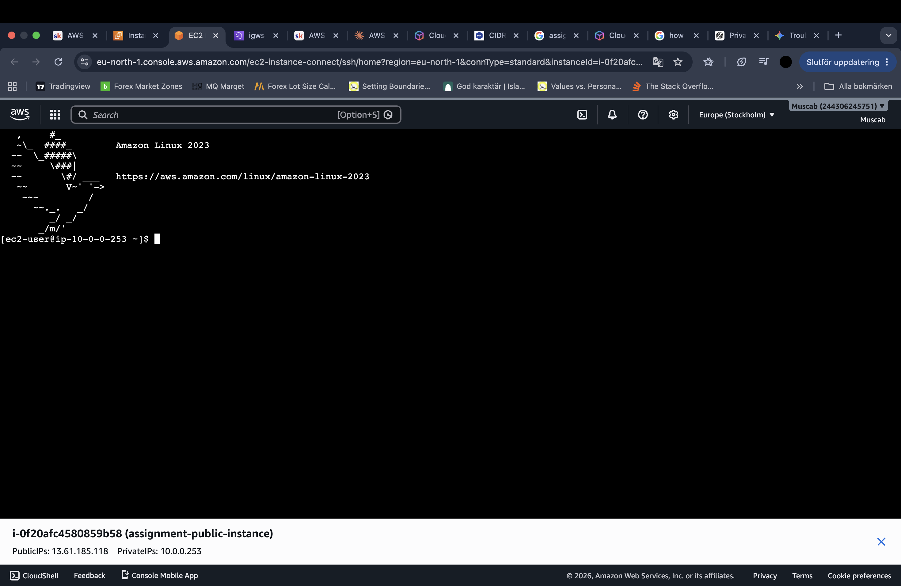
